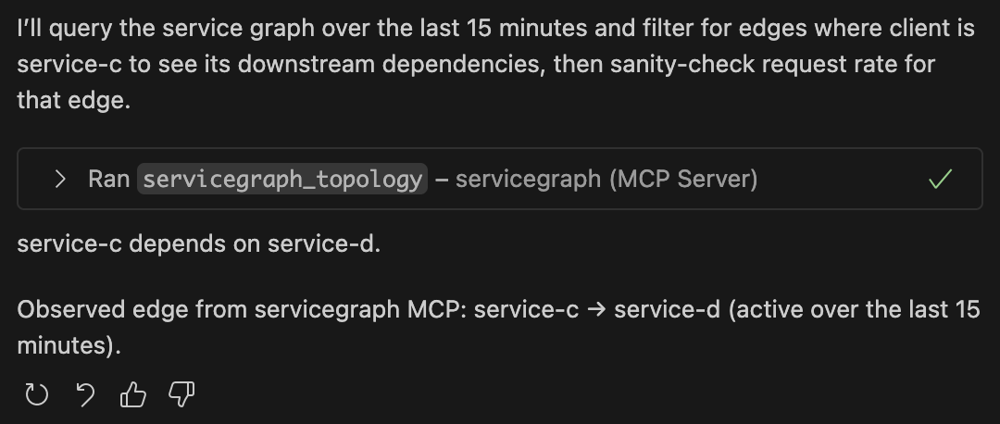

# MCP ServiceGraph Server

  
   
  <em>Interact with your service graph via MCP tools.</em>
 

This repo spins up a local Observability stack and a small MCP server that exposes service graph and spanmetrics data (via Prometheus/Mimir) as MCP tools.

Stack components:
- OpenTelemetry Collector with spanmetrics and servicegraph connectors
- Grafana Mimir (Prometheus-compatible TSDB)
- Grafana (optional UI)
- Test services (service-a → service-b → service-c → service-d)
- MCP HTTP server (JSON‑RPC 2.0) exposing tools backed by PromQL queries

## How it works
- The test services emit OpenTelemetry traces to the Collector (gRPC 4317).
- Collector processors generate:
  - spanmetrics (requests, latency histograms) labeled with service_name, peer_service, span_kind
  - servicegraph metrics (client ↔ server edges)
- Metrics are exported to Mimir and available via the Prometheus HTTP API.
- The MCP server (at http://localhost:9020) implements JSON‑RPC and translates tool calls into PromQL queries against Mimir.

## Run
1) Build and start everything with Docker Compose:

   docker compose up -d --build

2) Services:
- MCP: http://localhost:9020 (health: /healthz, RPC: /rpc)
- Grafana: http://localhost:3000 (preprovisioned to read from Mimir)
- Mimir Prometheus API: http://localhost:9009/prometheus
- Test services: service-a:8080, service-b:8081, service-c:8082, service-d:8083

The test services self-generate traffic, so edges appear automatically.

## MCP API
The MCP server speaks JSON‑RPC 2.0 over HTTP POST at /rpc.

Methods:
- initialize
- tools/list
- tools/call
- shutdown

Tools exposed by tools/list:
- servicegraph_topology
  - Description: Return client→server edge weights from servicegraph_request_total over a recent window
  - Args: { windowMinutes?: number = 10 }
- servicegraph_latency_p95
  - Description: p95 server-side latency for a client→server edge (spanmetrics)
  - Args: { client: string, server: string, windowMinutes?: number = 10 }
- spanmetrics_latency_quantile
  - Description: latency quantile for a client→server edge
  - Args: { client: string, server: string, quantile?: number = 0.95, windowMinutes?: number = 10 }
- spanmetrics_rps
  - Description: requests per second for a server (optionally by client)
  - Args: { server: string, client?: string, windowMinutes?: number = 10 }
- spanmetrics_top_callers
  - Description: Top‑N callers (peer_service) to a server by RPS
  - Args: { server: string, limit?: number = 5, windowMinutes?: number = 10 }
- spanmetrics_top_endpoints
  - Description: Top‑N span names (endpoints) for a server by RPS
  - Args: { server: string, limit?: number = 5, windowMinutes?: number = 10 }

## Example requests
Initialize:

POST /rpc
{
  "id": 1,
  "jsonrpc": "2.0",
  "method": "initialize",
  "params": {}
}

List tools:

POST /rpc
{
  "id": 2,
  "jsonrpc": "2.0",
  "method": "tools/list",
  "params": {}
}

Topology (last 15 minutes):

POST /rpc
{
  "id": 3,
  "jsonrpc": "2.0",
  "method": "tools/call",
  "params": {
    "name": "servicegraph_topology",
    "arguments": { "windowMinutes": 15 }
  }
}

p95 for service-a → service-b:

POST /rpc
{
  "id": 4,
  "jsonrpc": "2.0",
  "method": "tools/call",
  "params": {
    "name": "servicegraph_latency_p95",
    "arguments": { "client": "service-a", "server": "service-b", "windowMinutes": 10 }
  }
}

Top callers to service-c:

POST /rpc
{
  "id": 5,
  "jsonrpc": "2.0",
  "method": "tools/call",
  "params": {
    "name": "spanmetrics_top_callers",
    "arguments": { "server": "service-c", "limit": 5 }
  }
}

## Configuration
- Collector config: `otel-collector-config.yaml` (spanmetrics + servicegraph connectors, PRW exporter)
- Grafana datasource: `grafana/provisioning/datasources/mimir.yaml`
- MCP server queries Mimir at `MIMIR_URL` (default http://mimir:9009/prometheus)
- MCP listen address `MCP_LISTEN_ADDR` (default :9020)

## Notes
- The testapp sets proper service.name and peer.service attributes and uses W3C propagation so edges resolve correctly.
- If edges show as "unknown", wait a minute for metrics rollup or verify instrumentation and collector pipelines.
